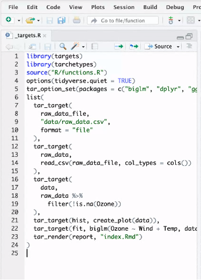
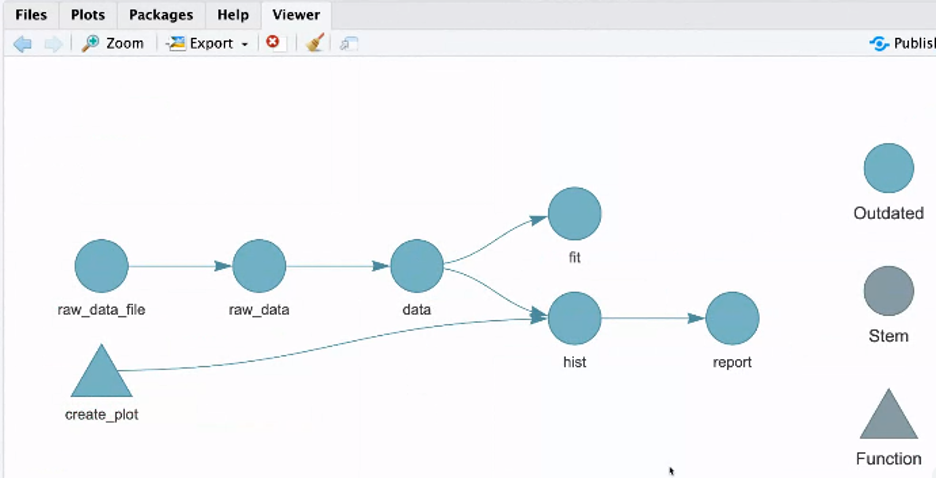
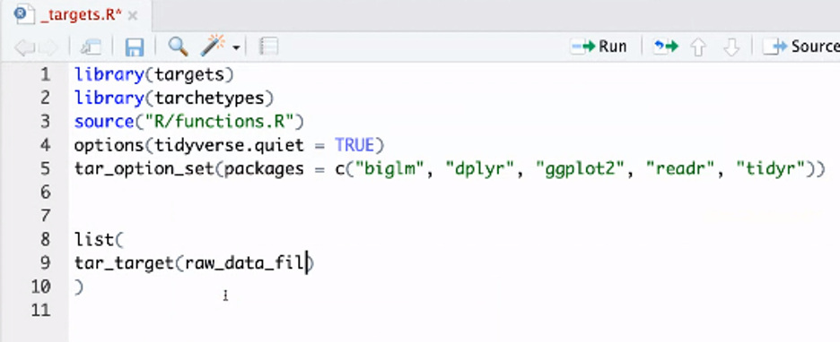
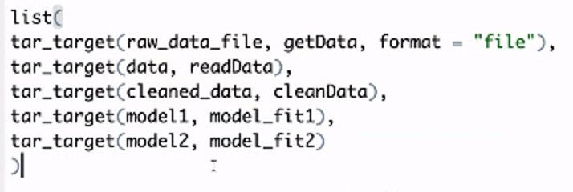
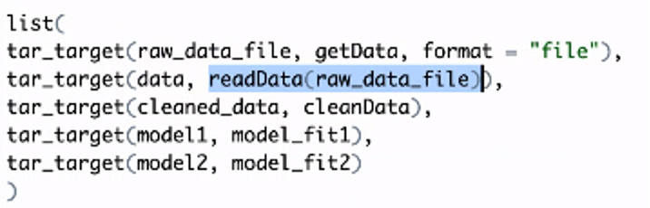
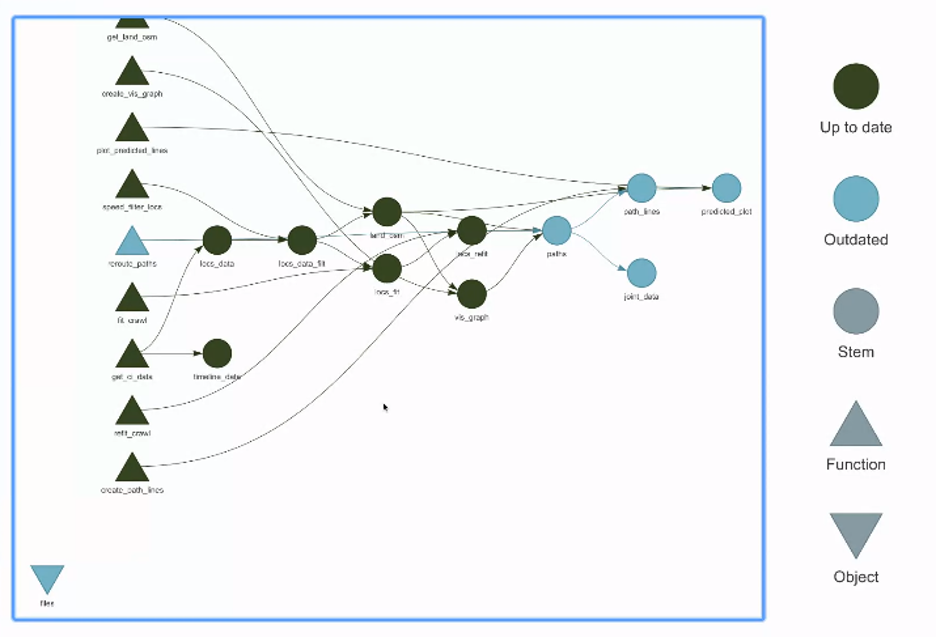
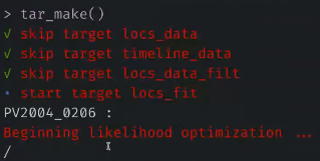

# Notes from the session

[Full meeting notes with the chat - NOAA access only](https://docs.google.com/document/d/1mrgtrSXVtPCTxrpBa_0ZbxEsnK9vcQzs6RIV3f-OTPw)

[Recording of the session - NOAA access only](https://drive.google.com/file/d/1D8CPg3GDqJt1jwAMn4FoVDThTViHvusr/view?usp=sharing)

# How can {targets} be incorporated into our workflows?

## Resources

* Pkgdown: https://docs.ropensci.org/targets/ 
* Bookdown: https://books.ropensci.org/targets/ 
* RStudio Cloud Minimal Example: https://rstudio.cloud/project/1430691
* Will Landau's Talks: [Target Markdown R/medicine in 2021](https://youtu.be/HJI5mQJRGpY); [NY Open Stats Meetup 2020](https://nyhackr.blob.core.windows.net/presentations/targets_Will-Landau.pdf)

## Overview

* {targets} is a “Make-like pipeline toolkit”. You are likely already using pipeline structures without even knowing it! (e.g., pipelines `%>%` in tidyverse). 
{targets} allows you to maintain a reproducible workflow without repeating yourself. 
* {targets} is function-based - need to have defined functions with dependencies, inputs, outputs. Smaller functions are easier to troubleshoot, but create a more complicated pipeline
* Targettopia - the universe! https://wlandau.github.io/targetopia/packages.html 
    * Allows STAN or JAGS in your work if you are working on a bayesian project. 
    * Highly integrated with the {futures} package. 

## Workflow

Walkthrough: https://books.ropensci.org/targets/walkthrough.html

Example set up: 

Will create: 

`tar_target(function, input, format = “”)` specifies each node in the image above.

Creating a network of dependencies and what can happen simultaneously on different servers/cores/processors. {Targets} will handle the allocation of those for you!

`tar_make()` runs the targets defined with `tar_target()`

Mindset shift: modularizing your code is key for using this workflow (note `source(“R/functions.R)` in Josh’s code - here separated for mental space, not required to be seperate. 

* Mental steps

    * Basic set up: 

* Outline what needs to happen: 

* Provide dependencies (e.g., data needed for analysis) 

* Markdown: Read up on Target Markdown and more discussion in Will’s Rmedicince talk

* Modeling: A more complicated example of a workflow from Josh’s work: https://github.com/jmlondon/berchukHaulout 

## Questions from the chat

*So targets keeps track of what has changed and only updates the needed parts when you re-run? Does it have a cache?*

Yes! 

*And those changes are changes to the data, not the code? Or both?*

Both!

Example of cache: , here `tar_load()` is loading data from the cache. 

Parts that dont need to be done again are skipped.

*Functions with single and multiple inputs? Is there an issue?*

Shouldn’t be, but could investigate more? 

*assuming this workflow would also work if all functions were all part of an R package. have you tried that?*

This might be an off-label use…use the targets workflow and then see how your workflow can be integrated

*Will updates to package dependencies invalidate the workflow?*

Maybe there is a way, but no. The {Targets} creator likely expects you to also use the {renv} package to manage dependencies if that is a concern. 

Examples we can refer to and follow:
https://github.com/jmlondon/berchukHaulout 
